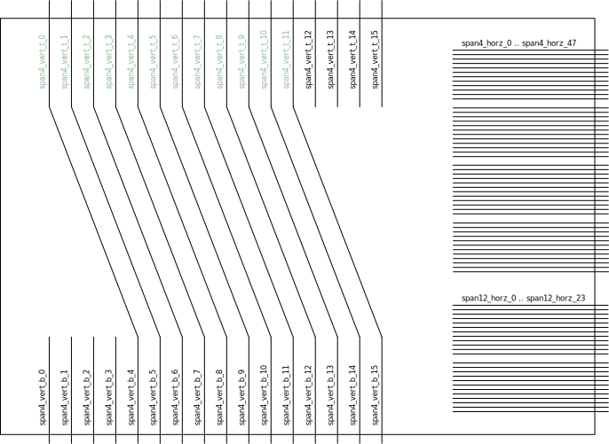
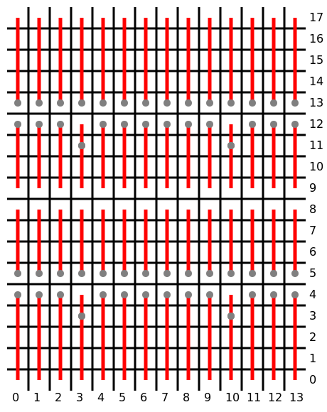

IO Tile Documentation
=====================

Span-4 and Span-12 Wires
------------------------

|IO Tile Span-Wires|

The image on the right shows the span-wires of a left (or right) io cell
(click to enlarge).

A left/right io cell has 16 connections named span4_vert_t_0 to
span4_vert_t_15 on its top edge and 16 connections named span4_vert_b_0
to span4_vert_b_15 on its bottom edge. The nets span4_vert_t_0 to
span4_vert_t_11 are connected to span4_vert_b_4 to span4_vert_b_15. The
span-4 and span-12 wires of the adjacent logic cell are connected to the
nets span4_horz_0 to span4_horz_47 and span12_horz_0 to span12_horz_23.

A top/bottom io cell has 16 connections named span4_horz_l_0 to
span4_horz_l_15 on its left edge and 16 connections named span4_horz_r_0
to span4_horz_r_15 on its right edge. The nets span4_horz_l_0 to
span4_horz_l_11 are connected to span4_horz_r_4 to span4_horz_r_15. The
span-4 and span-12 wires of the adjacent logic cell are connected to the
nets span4_vert_0 to span4_vert_47 and span12_vert_0 to span12_vert_23.

The vertical span4 wires of left/right io cells are connected "around
the corner" to the horizontal span4 wires of the top/bottom io cells.
For example span4_vert_b_0 of IO cell (0 1) is connected to
span4_horz_l_0 (span4_horz_r_4) of IO cell (1 0).

Note that unlike the span-wires connection LOGIC and RAM tiles, the
span-wires connecting IO tiles to each other are not pairwise crossed
out.

IO Blocks
---------

Each IO tile contains two IO blocks. Each IO block essentially
implements the SB_IO primitive from the Lattice iCE Technology Library.
Some inputs are shared between the two IO blocks. The following table
lists how the wires in the logic tile map to the SB_IO primitive ports:

================= ================ ============
SB_IO Port        IO Block 0       IO Block 1
================= ================ ============
D_IN_0            io_0/D_IN_0      io_1/D_IN_0
D_IN_1            io_0/D_IN_1      io_1/D_IN_1
D_OUT_0           io_0/D_OUT_0     io_1/D_OUT_0
D_OUT_1           io_0/D_OUT_1     io_1/D_OUT_1
OUTPUT_ENABLE     io_0/OUT_ENB     io_1/OUT_ENB
CLOCK_ENABLE      io_global/cen    
INPUT_CLK         io_global/inclk  
OUTPUT_CLK        io_global/outclk 
LATCH_INPUT_VALUE io_global/latch  
================= ================ ============

Like the inputs to logic cells, the inputs to IO blocks are routed to
the IO block via a two-stage process. A signal is first routed to one of
16 local tracks in the IO tile and then from the local track to the IO
block.

The io_global/latch signal is shared among all IO tiles on an edge of
the chip and is driven by fabout from one dedicated IO tile on that
edge. For the HX1K chips the tiles driving the io_global/latch signal
are: (0, 7), (13, 10), (5, 0), and (8, 17)

A logic tile sends the output of its eight logic cells to its neighbour
tiles. An IO tile does the same thing with the four D_IN signals created
by its two IO blocks. The D_IN signals map to logic function indices as
follows:

============== ===========
Function Index D_IN Wire
============== ===========
0              io_0/D_IN_0
1              io_0/D_IN_1
2              io_1/D_IN_0
3              io_1/D_IN_1
4              io_0/D_IN_0
5              io_0/D_IN_1
6              io_1/D_IN_0
7              io_1/D_IN_1
============== ===========

For example the signal io_1/D_IN_0 in IO tile (0, 5) can be seen as
neigh_op_lft_2 and neigh_op_lft_6 in LOGIC tile (1, 5).

Each IO Tile has 2 NegClk configuration bits, suggesting that the clock
signals can be inverted independently for the the two IO blocks in the
tile. However, the Lattice tools refuse to pack two IO blocks with
different clock polarity into the same IO tile. In our tests we only
managed to either set or clear both NegClk bits.

Each IO block has two IoCtrl IE bits that enable the input buffers and
two IoCtrl REN bits that enable the pull up resistors. Both bits are
active low, i.e. an unused IO tile will have both IE bits set and both
REN bits cleared (the default behavior is to enable pullup resistors on
all unused pins). Note that icebox_explain.py will ignore all IO tiles
that only have the two IoCtrl IE bits set.

However, the IoCtrl IE_0/IE_1 and IoCtrl REN_0/REN_1 do not necessarily
configure the IO PIN that are connected to the IO block in the same
tile, and if they do the numbers (0/1) do not necessarily match. As a
general rule, the pins on the right and bottom side of the chips match
up with the IO blocks and for the pins on the left and top side the
numbers must be swapped. But in some cases the IO block and the set of
IE/REN are not even located in the same tile. The following table lists
the correlation between IO blocks and IE/REN bits for the 1K chip:

======== ============
IO Block IE/REN Block
======== ============
0 14 1   0 14 0
0 14 0   0 14 1
0 13 1   0 13 0
0 13 0   0 13 1
0 12 1   0 12 0
0 12 0   0 12 1
0 11 1   0 11 0
0 11 0   0 11 1
0 10 1   0 10 0
0 10 0   0 10 1
0 9 1    0 9 0
0 9 0    0 9 1
0 8 1    0 8 0
0 8 0    0 8 1
0 6 1    0 6 0
0 6 0    0 6 1
0 5 1    0 5 0
0 5 0    0 5 1
0 4 1    0 4 0
0 4 0    0 4 1
0 3 1    0 3 0
0 3 0    0 3 1
0 2 1    0 2 0
0 2 0    0 2 1
======== ============

======== ============
IO Block IE/REN Block
======== ============
1 0 0    1 0 0
1 0 1    1 0 1
2 0 0    2 0 0
2 0 1    2 0 1
3 0 0    3 0 0
3 0 1    3 0 1
4 0 0    4 0 0
4 0 1    4 0 1
5 0 0    5 0 0
5 0 1    5 0 1
6 0 1    6 0 0
7 0 0    6 0 1
6 0 0    7 0 0
7 0 1    7 0 1
8 0 0    8 0 0
8 0 1    8 0 1
9 0 0    9 0 0
9 0 1    9 0 1
10 0 0   10 0 0
10 0 1   10 0 1
11 0 0   11 0 0
11 0 1   11 0 1
12 0 0   12 0 0
12 0 1   12 0 1
======== ============

======== ============
IO Block IE/REN Block
======== ============
13 1 0   13 1 0
13 1 1   13 1 1
13 2 0   13 2 0
13 2 1   13 2 1
13 3 1   13 3 1
13 4 0   13 4 0
13 4 1   13 4 1
13 6 0   13 6 0
13 6 1   13 6 1
13 7 0   13 7 0
13 7 1   13 7 1
13 8 0   13 8 0
13 8 1   13 8 1
13 9 0   13 9 0
13 9 1   13 9 1
13 11 0  13 10 0
13 11 1  13 10 1
13 12 0  13 11 0
13 12 1  13 11 1
13 13 0  13 13 0
13 13 1  13 13 1
13 14 0  13 14 0
13 14 1  13 14 1
13 15 0  13 15 0
13 15 1  13 15 1
======== ============

======== ============
IO Block IE/REN Block
======== ============
12 17 1  12 17 1
12 17 0  12 17 0
11 17 1  11 17 1
11 17 0  11 17 0
10 17 1  9 17 1
10 17 0  9 17 0
9 17 1   10 17 1
9 17 0   10 17 0
8 17 1   8 17 1
8 17 0   8 17 0
7 17 1   7 17 1
7 17 0   7 17 0
6 17 1   6 17 1
5 17 1   5 17 1
5 17 0   5 17 0
4 17 1   4 17 1
4 17 0   4 17 0
3 17 1   3 17 1
3 17 0   3 17 0
2 17 1   2 17 1
2 17 0   2 17 0
1 17 1   1 17 1
1 17 0   1 17 0
======== ============

When an input pin pair is used as LVDS pair (IO standard SB_LVDS_INPUT,
bank 3 / left edge only), then the four bits IoCtrl IE_0/IE_1 and IoCtrl
REN_0/REN_1 are all set, as well as the IoCtrl LVDS bit.

In the iCE 8k devices the IoCtrl IE bits are active high. So an unused
IO tile on an 8k chip has all bits cleared.

Global Nets
-----------

iCE40 FPGAs have 8 global nets. Each global net can be driven directly
from an IO pin. In the FPGA bitstream, routing of external signals to
global nets is not controlled by bits in the IO tile. Instead bits that
do not belong to any tile are used. In IceBox nomenclature such bits are
called "extra bits".

The following table lists which pins / IO blocks may be used to drive
which global net, and what .extra statements in the IceStorm ASCII file
format to represent the corresponding configuration bits:

+-----------------+-----------------+-----------------+-----------------+
| Glb Net         | Pin             | IO Tile +       | IceBox          |
|                 | (HX1K-TQ144)    | Block #         | Statement       |
+=================+=================+=================+=================+
| 0               | 93              | 13 8 1          | .extra_bit 0    |
|                 |                 |                 | 330 142         |
+-----------------+-----------------+-----------------+-----------------+
| 1               | 21              | 0 8 1           | .extra_bit 0    |
|                 |                 |                 | 331 142         |
+-----------------+-----------------+-----------------+-----------------+
| 2               | 128             | 7 17 0          | .extra_bit 1    |
|                 |                 |                 | 330 143         |
+-----------------+-----------------+-----------------+-----------------+
| 3               | 50              | 7 0 0           | .extra_bit 1    |
|                 |                 |                 | 331 143         |
+-----------------+-----------------+-----------------+-----------------+
| 4               | 20              | 0 9 0           | .extra_bit 1    |
|                 |                 |                 | 330 142         |
+-----------------+-----------------+-----------------+-----------------+
| 5               | 94              | 13 9 0          | .extra_bit 1    |
|                 |                 |                 | 331 142         |
+-----------------+-----------------+-----------------+-----------------+
| 6               | 49              | 6 0 1           | .extra_bit 0    |
|                 |                 |                 | 330 143         |
+-----------------+-----------------+-----------------+-----------------+
| 7               | 129             | 6 17 1          | .extra_bit 0    |
|                 |                 |                 | 331 143         |
+-----------------+-----------------+-----------------+-----------------+

Signals internal to the FPGA can also be routed to the global nets. This
is done by routing the signal to the fabout net on an IO tile. The same
set of I/O tiles is used for this, but in this case each of the I/O
tiles corresponds to a different global net:

======= === ==== ==== === ==== === === ====
Glb Net 0   1    2    3   4    5   6   7
IO Tile 7 0 7 17 13 9 0 9 6 17 6 0 0 8 13 8
======= === ==== ==== === ==== === === ====

|Column Buffers|

Column Buffer Control Bits
~~~~~~~~~~~~~~~~~~~~~~~~~~

Each LOGIC, IO, and RAMB tile has 8 ColBufCtrl bits, one for each global
net. In most tiles this bits have no function, but in tiles in rows 4,
5, 12, and 13 (for RAM columns: rows 3, 5, 11, and 13) this bits control
which global nets are driven to the column of tiles below and/or above
that tile (including that tile), as illustrated in the image to the
right (click to enlarge).

In 8k chips the rows 8, 9, 24, and 25 contain the column buffers. 8k
RAMB and RAMT tiles can control column buffers, so the pattern looks the
same for RAM, LOGIC, and IO columns.

Warmboot
--------

The SB_WARMBOOT primitive in iCE40 FPGAs has three inputs and no
outputs. The three inputs of that cell are driven by the fabout signal
from three IO tiles. In HX1K chips the tiles connected to the
SB_WARMBOOT primitive are:

============ =======
Warmboot Pin IO Tile
============ =======
BOOT         12 0
S0           13 1
S1           13 2
============ =======

PLL Cores
---------

The PLL primitives in iCE40 FPGAs are configured using the PLLCONFIG\_\*
bits in the IO tiles. The configuration for a single PLL cell is spread
out over many IO tiles. For example, the PLL cell in the 1K chip are
configured as follows (bits listed from LSB to MSB):

+-----------------------+-----------------------+-----------------------+
| IO Tile               | Config Bit            | SB_PLL40\_\*          |
|                       |                       | Parameter             |
+=======================+=======================+=======================+
| 0 3                   | PLLCONFIG_5           | Select PLL Type:      |
|                       |                       | 000 = DISABLED        |
|                       |                       | 010 = SB_PLL40_PAD    |
|                       |                       | 100 = SB_PLL40_2_PAD  |
|                       |                       | 110 = SB_PLL40_2F_PAD |
|                       |                       | 011 = SB_PLL40_CORE   |
|                       |                       | 111 =                 |
|                       |                       | SB_PLL40_2F_CORE      |
+-----------------------+-----------------------+-----------------------+
| 0 5                   | PLLCONFIG_1           |                       |
+-----------------------+-----------------------+-----------------------+
| 0 5                   | PLLCONFIG_3           |                       |
+-----------------------+-----------------------+-----------------------+
| 0 5                   | PLLCONFIG_5           | FEEDBACK_PATH         |
|                       |                       | 000 = "DELAY"         |
|                       |                       | 001 = "SIMPLE"        |
|                       |                       | 010 =                 |
|                       |                       | "PHASE_AND_DELAY"     |
|                       |                       | 110 = "EXTERNAL"      |
+-----------------------+-----------------------+-----------------------+
| 0 2                   | PLLCONFIG_9           |                       |
+-----------------------+-----------------------+-----------------------+
| 0 3                   | PLLCONFIG_1           |                       |
+-----------------------+-----------------------+-----------------------+
| 0 4                   | PLLCONFIG_4           | DELAY_ADJ             |
|                       |                       | USTMENT_MODE_FEEDBACK |
|                       |                       | 0 = "FIXED"           |
|                       |                       | 1 = "DYNAMIC"         |
+-----------------------+-----------------------+-----------------------+
| 0 4                   | PLLCONFIG_9           | DELAY_ADJ             |
|                       |                       | USTMENT_MODE_RELATIVE |
|                       |                       | 0 = "FIXED"           |
|                       |                       | 1 = "DYNAMIC"         |
+-----------------------+-----------------------+-----------------------+
| 0 3                   | PLLCONFIG_6           | PLLOUT_SELECT         |
|                       |                       | PLLOUT_SELECT_PORTA   |
|                       |                       | 00 = "GENCLK"         |
|                       |                       | 01 = "GENCLK_HALF"    |
|                       |                       | 10 = "SHIFTREG_90deg" |
|                       |                       | 11 = "SHIFTREG_0deg"  |
+-----------------------+-----------------------+-----------------------+
| 0 3                   | PLLCONFIG_7           |                       |
+-----------------------+-----------------------+-----------------------+
| 0 3                   | PLLCONFIG_2           | PLLOUT_SELECT_PORTB   |
|                       |                       | 00 = "GENCLK"         |
|                       |                       | 01 = "GENCLK_HALF"    |
|                       |                       | 10 = "SHIFTREG_90deg" |
|                       |                       | 11 = "SHIFTREG_0deg"  |
+-----------------------+-----------------------+-----------------------+
| 0 3                   | PLLCONFIG_3           |                       |
+-----------------------+-----------------------+-----------------------+
| 0 3                   | PLLCONFIG_4           | SHIFTREG_DIV_MODE     |
+-----------------------+-----------------------+-----------------------+
| 0 3                   | PLLCONFIG_8           | TEST_MODE             |
+-----------------------+-----------------------+-----------------------+
| 0 5                   | PLLCONFIG_2           | Enable ICEGATE for    |
|                       |                       | PLLOUTGLOBALA         |
+-----------------------+-----------------------+-----------------------+
| 0 5                   | PLLCONFIG_4           | Enable ICEGATE for    |
|                       |                       | PLLOUTGLOBALB         |
+-----------------------+-----------------------+-----------------------+

======= =========== ======================
IO Tile Config Bit  SB_PLL40\_\* Parameter
======= =========== ======================
0 3     PLLCONFIG_9 FDA_FEEDBACK
0 4     PLLCONFIG_1 
0 4     PLLCONFIG_2 
0 4     PLLCONFIG_3 
0 5     PLLCONFIG_5 FDA_RELATIVE
0 4     PLLCONFIG_6 
0 4     PLLCONFIG_7 
0 4     PLLCONFIG_8 
0 1     PLLCONFIG_1 DIVR
0 1     PLLCONFIG_2 
0 1     PLLCONFIG_3 
0 1     PLLCONFIG_4 
0 1     PLLCONFIG_5 DIVF
0 1     PLLCONFIG_6 
0 1     PLLCONFIG_7 
0 1     PLLCONFIG_8 
0 1     PLLCONFIG_9 
0 2     PLLCONFIG_1 
0 2     PLLCONFIG_2 
0 2     PLLCONFIG_3 DIVQ
0 2     PLLCONFIG_4 
0 2     PLLCONFIG_5 
0 2     PLLCONFIG_6 FILTER_RANGE
0 2     PLLCONFIG_7 
0 2     PLLCONFIG_8 
======= =========== ======================

The PLL inputs are routed to the PLL via the fabout signal from various
IO tiles. The non-clock PLL outputs are routed via otherwise unused
neigh_op\_\* signals in fabric corners. For example in case of the 1k
chip:

==== ============== ======================
Tile Net-Segment    SB_PLL40\_\* Port Name
==== ============== ======================
0 1  fabout         REFERENCECLK
0 2  fabout         EXTFEEDBACK
0 4  fabout         DYNAMICDELAY
0 5  fabout         
0 6  fabout         
0 10 fabout         
0 11 fabout         
0 12 fabout         
0 13 fabout         
0 14 fabout         
1 1  neigh_op_bnl_1 LOCK
1 0  fabout         BYPASS
2 0  fabout         RESETB
5 0  fabout         LATCHINPUTVALUE
12 1 neigh_op_bnr_3 SDO
4 0  fabout         SDI
3 0  fabout         SCLK
==== ============== ======================

The PLL clock outputs are fed directly into the input path of certain IO
tiles. In case of the 1k chip the PORTA clock is fed into PIO 1 of IO
Tile (6 0) and the PORTB clock is fed into PIO 0 of IO Tile (7 0).
Because of this, those two PIOs can only be used as output Pins by the
FPGA fabric when the PLL ports are being used.

The input path that are stolen are also used to implement the ICEGATE
function. If the input pin type of the input path being stolen is set to
PIN_INPUT_LATCH, then the ICEGATE function is enabled for the
corresponding CORE output of the PLL.

