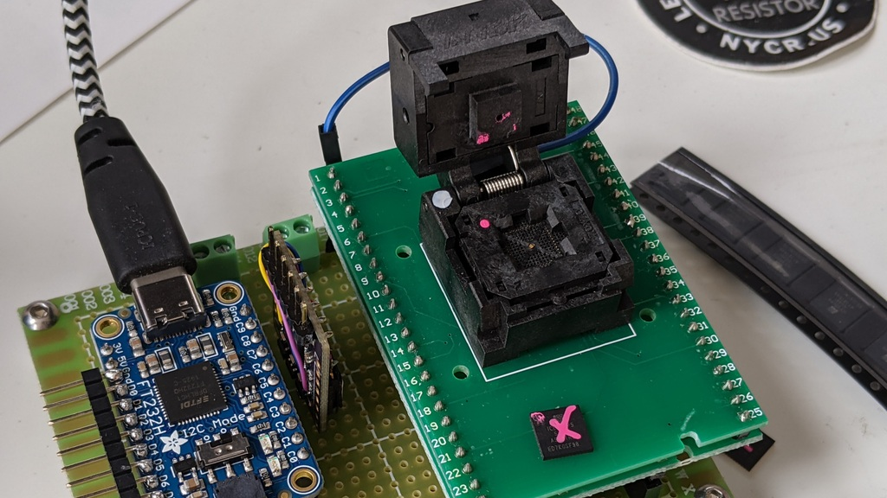
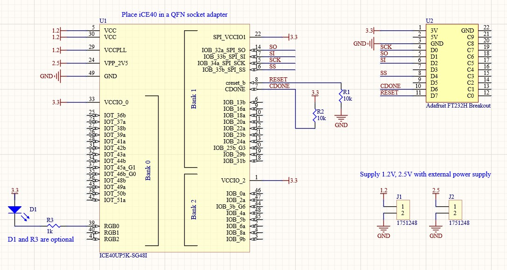

Tool for writing the one time programmable non-volatile configuration memory
in the iCE40up5k FPGA chips.

**DANGER: this will probably brick your chip**

* [Adafruit FTDI232H breakout board](https://www.adafruit.com/product/2264)
* [QFN48 ZIF socket](https://nl.aliexpress.com/item/1005003023038405.html)
* 1.2V regulator
* 2.5V regulator
* 2pc 10k resistor

| Function | FTDI pin | FPGA pin |
| -------- | -------- | -------- |
| Clk      | D0       | 15       |
| DO       | D1       | 14       |
| DI       | D2       | 17       |
| CS       | D4       | 16       |
| Reset    | D7       | 8        |
| CDONE    | D6       | 7        |

## NVCM Commands

These commands appear in the vendor tools. 

| Command       | Out | Wait | In  | Description |
| ---           | --- | ---  | --- | --- |
| 7eaa997e010e  | 6   | 0    | 0   | Enter NVCM mode |
| 02,addr,data  | 12  | 0    | 0   | Write to register at specified address. Address is 3 bytes, data is 8 bytes |
| 03,addr       | 4   | 9    | n   | Read from register at specified address. Address is 3 bytes, data is n bytes |
| 04            | 1   | 0    | 0   | Program disable |
| 05            | 1   | 0    | 1   | Read status register (Note: Guess that status register is 1 byte) |
| 06            | 1   | 0    | 0   | Program enable |
| 82000020,data | 12  | 0    | 0   | Write to trim register. For read: 00000000c4000000, For write: 0015f2f0c2000000  |
| 83000025,bank | 5   | 0    | 0   | Bank select: NVCM:00, Trim:10:, Signature:20 |
| 84000020      | 4   | 9    | 8   | Read RF (trim) register |

Notes:

* Commands 82, 83, 84 are likely single byte + address, but are only used with the above addresses.
* Search for other commands has not been attempted.

## Register maps

These memory regions are accessed by the vendor tools

### NVCM bank

| Address Range | Description |
| ---           | ---         |
| 000000-?      | Configuration bitstream. At least 104090 bytes long, possibly 104960 |

When reading it appears as a normal linear array.  When writing the address
range is with 328 bytes per 4K page: `int(addr / 328) * 4096 + (addr % 328)`.
Only the non-zero blocks of 8-bytes are written.

Until the chip is locked, the NVCM data can be read back and appears to
be identical to the bitstream.  It can also be written multiple times
while unlocked, with NAND semantics (default values are 0, bits can only
be set, not cleared).

### Trim bank

| Address Range | Description |
| ---           | ---         |
| 000020-000027 | Trim row 1. Set to: 0015f2f1c4000000. Byte 0 is read to determine if NVCM is programmed. This whole register is checked to see if trim was programmed properly. |
| 000060-000067 | Trim row 2 |
| 0000a0-0000a7 | Trim row 3 |
| 0000e0-0000e7 | Trim row 4 |

Notes:

* Programming all four trim registers with `0015f2f1c4000000` will cause the device to boot from NVCM (maybe)
* Programming all for trim registers with `3000000100000000` will set the NVCM security bit (maybe)
* The trim registers have NAND semantics, so bits can only be set, never unset

### Signature bank

| Address Range | Description |
| ---           | ---         |
| 000000-000007 | Signature bits (lower 8 bytes) |
| 000008-00000F | Signature bits (upper 8 bytes) |

Notes:

* The byte at address 000000 contains the chip ID, and is programmed at the factory. 0x20 identifies the device is ICE40UP5K. Other device values are listed but untested.
* The vendor tool writes configuration data (programmer revision, build, date), along with a CRC. It's unclear if the chip can access this data.  This tool does not write those values.
